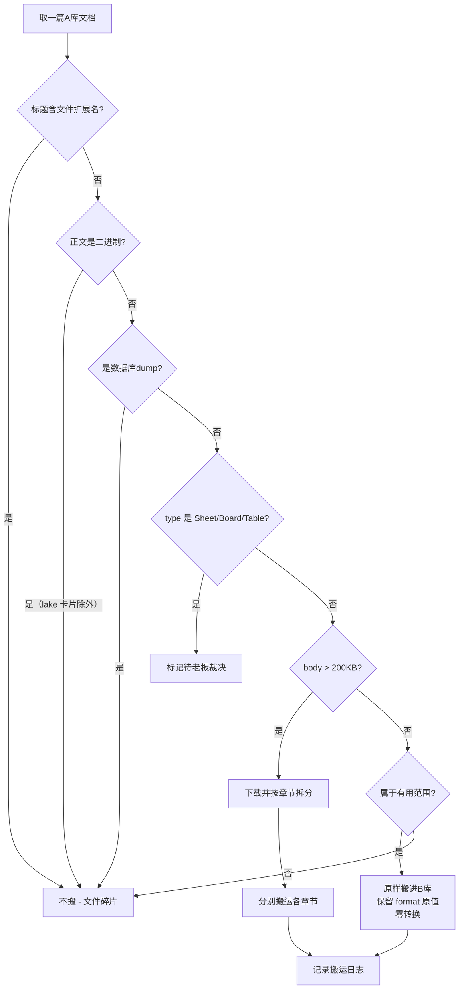

# doc-reorg-skill

语雀知识库文档整理 Skill：**随看随搬、零格式转换、人工终审闸**。

## 解决什么

把源知识库（A 库）里的有用文档筛选搬运到目标知识库（B 库），
适用于文档量大、无法先列清单再审的场景。

> 🆕 **姊妹 Skill**：需要「批量清洗 + 智能去重 + 断点续传」的重型迁移？看 [yuque-migration-skill](https://github.com/yehuoshun/yuque-migration-skill)（两套方案并存，按场景选用）

## 核心设计

1. **随看随搬** — 文档量大时不做"先列清单再审"，AI 边扫边判边搬
2. **搬运与格式解耦** — 搬运阶段只判"有用性"原样搬，格式统一（如有）单独一轮做
3. **零格式转换** — 源文档是什么格式（markdown / lake / html）就写什么，不转换
4. **人工终审闸** — AI 自查 ≠ 过审，终审通过前禁入库禁发布
5. **执行报告** — 每轮扫描结束强制出报告：概览 + 搬运清单 + **跳过清单（每条带原因+文档链接）** + 拿不准清单

## 使用

Skill 内容见 `SKILL.md`，判定规则细则见 `references/rules.md`，报告模板见 `references/report-template.md`。

## 规则速览

| 规则 | 判定 |
|---|---|
| R1 正文二进制 | 正文无法解析 → 不搬（lake 卡片除外） |
| R2 数据库 dump | 不搬 |
| R3 附件 | 正文是文字的，附件照搬 |
| R4 格式 | 源格式是什么就写什么，零转换 |
| R5 有用性 | 默认全扫法（非二进制/非dump/非文件碎片 全搬） |
| R6 类型 | Sheet/Board/Table 结构化文档另案处理 |
| R7 Big Doc 拆分 | body > 200KB 按章节拆分搬运 |
| R8 文件碎片 | 标题含 .7z/.flv/.rar 等扩展名快速跳过 |

## 协议

MIT License
