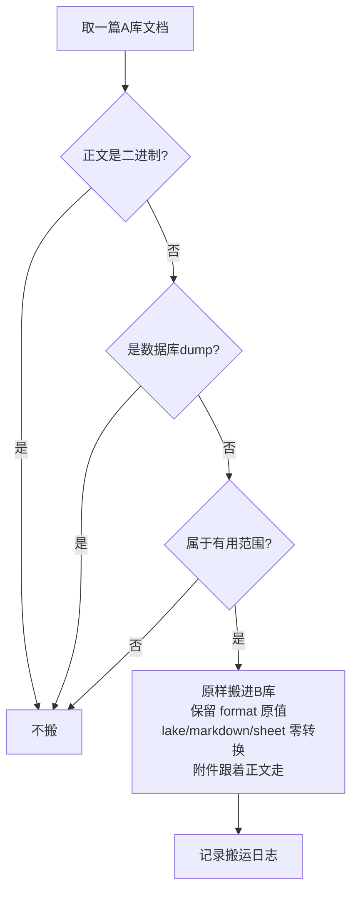

# Doc Reorg — 语雀知识库文档整理

把源知识库（A 库）里的有用文档筛选搬运到目标知识库（B 库），
随看随搬，格式零转换，人工终审闸兜底。

## 核心原则

1. **随看随搬**：文档量大时不做"先列清单再审"（老板审不过来），AI 边扫边判边搬
2. **搬运与格式解耦**：搬运阶段只判"有用性"，原样搬；格式统一（如有）单独一轮做
3. **零格式转换**：源文档 `format` 是什么就写什么（lake / markdown / sheet），不做格式转换
4. **人工终审闸**：AI 自查 ≠ 过审，过审以老板/主管人工终审为准，终审通过前禁入库禁发布

## 触发场景

- "整理语雀 / 整理 X 库到 Y 库"
- "从 A 库找有用文档搬到 B 库"
- "语雀文档迁移 / 筛选 / 归档"
- "随看随搬"

## 前置环境

- 语雀操作必须走 MCP（`yuque-mcp`，禁止直接 curl 调语雀 API）
- 读取工具：`yuque_web_list_repos` / `yuque_web_list_docs` / `yuque_web_get_doc`
- 搬运工具：`yuque_copy_doc`（或 `yuque_create_doc`）
- 目录结构：`yuque_get_toc` / `yuque_update_toc`

## 判定规则（先手拦截，AI 严格照办）

| 规则 | 判定 |
|---|---|
| R1 正文二进制 | 正文无法解析成文本 → **不搬** |
| R2 数据库 dump | 内容是数据库 dump → **不搬** |
| R3 附件 | 正文是文字的，附件照搬，随正文走 |
| R4 格式 | 源 `format` 是什么就写什么（lake/markdown/sheet）零转换 |
| R5 有用性 | 命中"有用范围"才搬，范围由老板在任务开始时给定 |

> 看正文，不看附件。正文能读出来就要，正文是二进制就不要；附件跟着正文走。

## 流程

### 步骤

1. **定范围**：向老板确认 A 库、B 库、以及"有用范围"（范围法 / 目录法 / 全扫法）
2. **列文档**：`yuque_web_list_docs` 分页拉取 A 库文档
3. **逐篇判定**：按 R1→R5 顺序判定
4. **搬运**：`yuque_copy_doc` 原样写入 B 库，`format` 传源文档的 format 原值
5. **记日志**：记录 文档名 / 源位置 / format / 搬运结果，形成搬运日志
6. **出执行报告**：扫描结束生成报告，含概览 + 搬运成功清单 + **跳过清单（跳过原因 + 跳过文档链接）** + 拿不准清单，模板见 `references/report-template.md`
7. **交终审**：报告 + 搬运结果交老板人工终审
8. **格式校验**：抽查 B 库文档确认格式未损坏（零转换后主要是校验动作）

### 执行报告（强制，每轮必出）

扫描结束必须产出一份执行报告，包含三块核心：

| 块 | 内容 | 格式要求 |
|---|---|---|
| 概览 | 扫描 / 搬运 / 跳过 / 拿不准数量 | 数字 + 一眼可读 |
| 搬运清单 | 成功搬入 B 库的文档 | 文档名 + 源格式 + 目标位置 |
| **跳过清单** | 被规则拦截的文档 | **文档名 + 跳过原因 + 文档链接，每条都有** |
| 拿不准清单 | 硬规则覆盖不到的 | 文档名 + 原因 + 链接，交老板扫一眼 |

**跳过清单必须满足**：
- 每条跳过都写明原因（映射 R1 正文二进制 / R2 数据库dump / R5 不在有用范围）
- 每条跳过都带**文档链接**（`https://www.yuque.com/{login}/{book_slug}/{doc_slug}`），老板点开即可复核
- 不允许只报数量不报明细

> 示例链接格式：`https://www.yuque.com/yehuoshun/{book_slug}/{doc_slug}`
> 链接来源：文档对象里的 `book.slug` + `slug` 字段拼接

## 人工终审闸（强制）

- AI 无权自判"审核通过"
- 终审通过前禁入库禁发布
- 终审通过后，搬运日志标注"(审核通过稿)"

## 错误处理

- **限流 429**：v2 API 被限流时改用 cookie 态 web 接口（`yuque_web_*`）
- **拿不准**：R5 命中不了硬规则时，打标"拿不准"列一行给老板扫一眼，不搬
