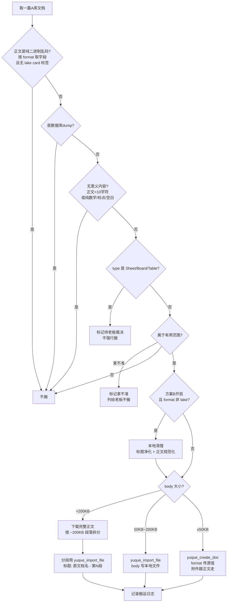

# Doc Reorg — 语雀知识库文档整理

把源知识库（A 库）里的有用文档筛选搬运到目标知识库（B 库），
随看随搬，格式零转换，人工终审闸兜底。

## 核心原则

1. **随看随搬**：文档量大时不做"先列清单再审"（老板审不过来），AI 边扫边判边搬
2. **搬运与格式解耦**：搬运阶段只判"有用性"；格式清理按老板选择：默认零转换原样搬；老板指定方案 B 时，markdown/html 在写入前清理，lake 原样不动
3. **零格式转换（默认）**：源文档 `format` 是什么就写什么（markdown / lake / html），不做格式转换
4. **方案 B 格式清理（v1，可选开关）**：仅对 `markdown` / `html` 格式文档做轻量清理（标题净化 + 正文规范化），`lake` 格式永远原样搬（防止损坏 card 附件），详见 R9
5. **人工终审闸**：AI 自查 ≠ 过审，过审以老板/主管人工终审为准，终审通过前禁入库禁发布。老板明确表态"暂不审"时跳过终审闸，但执行报告仍必出

## 触发场景

- "整理语雀 / 整理 X 库到 Y 库"
- "从 A 库找有用文档搬到 B 库"
- "语雀文档迁移 / 筛选 / 归档"
- "随看随搬"

## 不做什么（边界）

- 本 skill 承诺**不修改正文**：搬运阶段原样搬，R9 清理为可选且只动标题/空白
- 不做全量批量清洗（去剪藏垃圾样式）、不注入源链接、不做断点续传 —— 这些走姊妹 skill `batch-migration`
- 「全量 / 批量 / 千篇级 / 整个库一次搬完」类说法默认**不**归本 skill，交 `batch-migration`

## 前置环境

- 语雀操作必须走 MCP（`yuque-mcp`，禁止直接 curl 调语雀 API）
- **列表**：`yuque_web_list_docs`（Cookie 态；默认裁剪输出含 `id/type/slug/title/format/word_count/book` 等；传 `raw=true` 才额外含 `editor_meta` 等原始字段）——**本 skill 统一用它**。v2 的 `yuque_list_docs` 不返回 `type`，非必要不用
- **读取**：`yuque_get_doc`（v2 API，返回完整 `body` / `body_lake` / `body_html`）
  - ⚠️ `yuque_web_get_doc`（web API）不返回 `body_lake`，仅用于轻量查询
- **写入**：`yuque_create_doc`（body ≤ 50KB）/ `yuque_import_file`（body > 50KB，body 先写本地文件再传路径）
- **复制**：`yuque_copy_doc`（`paths` 必须是 JSON 数组字符串，用 `--args` 传参）
- **导出**：`yuque_export_doc`（取完整正文，R7 大文档拆分用）
- **目录**：`yuque_get_toc` / `yuque_update_toc` / `yuque_batch_update_toc`
- **备用（Cookie 态，v2 限流时）**：`yuque_web_*` 系列

## 判定规则（先手拦截，AI 严格照办）

| 规则 | 判定 |
|---|---|
| R1 正文二进制 | 正文是纯二进制乱码/不可读内容 → **不搬**。**判定字段按源 `format` 取：`lake` → `body_lake`，`markdown` → `body`，`html` → `body_html`；禁止用 `body` 判 lake 文档**（`body` 会 strip `<card>` 标签，把合法附件文档误判为二进制）。lake 格式含 `<card>` 标签的文档不算二进制（即使标题含文件扩展名，如 `.w3x/.js/.gif`，也不跳过） |
| R2 数据库 dump | 内容是数据库 dump → **不搬** |
| R3 附件 | 正文是文字的，附件照搬，随正文走 |
| R4 格式 | 源 `format` 是什么就写什么（markdown/lake/html）零转换；`yuque_get_doc` 返回的 body 字段选择：`format=markdown` → `body`，`format=lake` → `body_lake`，`format=html` → `body_html` |
| R5 有用性 | 命中"有用范围"才搬；默认**全扫法**（非二进制/非dump/非结构化文档 的全搬） |
| R6 类型 | `type=Sheet/Board/Table` 结构化文档另案处理（copy_doc 传不了结构化正文） |
| R7 Big Doc 拆分 | 文档 body > 200KB → 按 ~200KB 段落拆分搬运；`format` 一律传**源原值**（markdown/html/**lake** 都支持，不转格式） |
| R8 无意义内容 | 正文极短（< 10 字符）或仅含无意义字符（纯数字/标点/空白/对象引用/JSON元数据）→ **不搬** |
| R9 格式清理（方案 B，可选） | 老板开启时：markdown/html 写入前清理（标题去重复后缀/来源后缀，正文去多余空行/行尾空格）；**lake 永不清理**。细则见 `references/rules.md` |

> 判定标准只看 body 内容，不看标题。
> **优化技巧**：`yuque_web_list_docs` 传 `raw=true` 时才返回 `editor_meta`（默认裁剪输出不含），可用于快速预判文档是否含附件（`{"file":N}` / `{"video":N}`）。但仍以 body/card 判定为准，**不能单凭 editor_meta 就跳过**。
> 标题含 `.7z` / `.flv` / `.mp4` / `.zip` / `.rar` 等扩展名可以作为快速预判参考，但不能作为跳过依据——必须获取 body 后确认是否纯二进制乱码。
> lake 格式文档即使 body 含不可读数据（如视频卡片、文件卡片嵌入），只要包含 `<card>` 标签，就不算二进制。
> 判定优先级：R1 > R2 > R8 > R6 > R7 > R5 > R3，顺序判定，命中即止。

> R9 的完整清理细则（标题净化正则、正文规范化、去重、适用边界）统一维护在 `references/rules.md` 的 R9 小节，本文件不重复。

## 流程

### 步骤

1. **定范围**：向老板确认 A 库、B 库、以及"有用范围"（范围法 / 目录法 / 全扫法，默认全扫法）
2. **列文档**：`yuque_web_list_docs` 分页拉取 A 库文档
3. **逐篇判定**：按 R1→R2→R8→R6→R7→R5→R3 顺序判定，另查 `type` 字段（R6）
4. **取正文**：`yuque_get_doc` 获取文档后，按 format 选择对应 body 字段：`format=markdown` → `body`，`format=lake` → `body_lake`，`format=html` → `body_html`。**禁止**用 `body` 字段搬运 lake 格式文档（会丢失 card 标签内的附件链接）
5. **小文档搬运**：`yuque_create_doc` 写入 B 库，`format` 传源文档的 format 原值，`body` 传上一步选中的正确 body 字段；若老板开启方案 B（R9），markdown/html 先在本地做标题净化 + 正文规范化再写入，lake 原样
6. **Big Doc 拆分**：`yuque_get_doc` 取 body → 按 **~200KB 段落**切分（段落/空行边界，每段 ≤200KB）→ 每段写入本地文件，用 `yuque_import_file` 导入（`format` 传**源原值**，markdown / lake / html 都支持；`title` = `{原文档名} - 第 N 段`；`paths` 传目标目录，必填）。import_file 的 body 走文件、不受命令行长度限制；`create_doc` / `copy_doc` 的 body 走命令行参数，>50KB 才需要改走 import_file。**lake 拆分点必须避开 `<card>` 块**。
7. **记日志**：记录 文档名 / 源位置 / format / 搬运结果，形成搬运日志
8. **出执行报告**：扫描结束生成报告，含概览 + 搬运成功清单 + **跳过清单（跳过原因 + 跳过文档链接）** + Big Doc 拆分清单 + 拿不准清单，模板见 `references/report-template.md`
9. **交终审**：报告 + 搬运结果交老板人工终审
10. **格式校验**：抽查 B 库文档确认格式未损坏（零转换后主要是校验动作）

### 执行报告（强制，每轮必出）

扫描结束必须产出一份执行报告，包含三块核心：

| 块 | 内容 | 格式要求 |
|---|---|---|
| 概览 | 扫描 / 搬运 / 跳过 / Big Doc 拆分 / 拿不准数量 | 数字 + 一眼可读 |
| 搬运清单 | 成功搬入 B 库的文档 | 文档名 + 源格式 + 目标位置 |
| **Big Doc 拆分清单** | 因 >200KB 被拆分的文档 | 原文档名 + 拆分段数 + 目标位置 |
| **跳过清单** | 被规则拦截的文档 | **文档名 + 跳过原因 + 文档链接，每条都有** |
| 拿不准清单 | 硬规则覆盖不到的 | 文档名 + 原因 + 链接，交老板扫一眼 |

**跳过清单必须满足**：
- 每条跳过都写明原因（映射 R1 正文二进制 / R2 数据库dump / R5 不在有用范围 / R6 结构化类型待裁决 / R8 无意义内容 / R9 标题净化后为空或重复）
- 每条跳过都带**文档链接**（`https://www.yuque.com/{login}/{book_slug}/{doc_slug}`），老板点开即可复核
- 不允许只报数量不报明细

> 示例链接格式：`https://www.yuque.com/yehuoshun/{book_slug}/{doc_slug}`
> 链接来源：文档对象里的 `book.slug` + `slug` 字段拼接

### 报告放置

- 报告直接放在目标库**根目录**（level=0），不嵌套子目录
- 创建方式：生成完整 markdown 内容到本地文件，用 `yuque_import_file` 导入（避免 API body 长度限制）
- 首插：需要的话用**单文档** `yuque_update_toc` 的 `action=prependNode` + `action_mode=sibling` 把报告提到根目录首位；不要用 `batch_update_toc` 的 `moveNode`（见下方 TOC 操作局限）

### 跳过清单条目过多时的处理

当跳过条目超过 100 条时：
- 按原因分组展示（如 `R1 正文二进制（标题含 .7z）` 为一组）
- 每组首行标注数量，每条带链接
- 将完整 markdown 文件写入本地临时目录，再用 `yuque_import_file` 导入为目标库的首篇文档
- 完整 JSON 报告留存在本地供后续参考

模板见 `references/report-template.md`

## 人工终审闸（强制）

- AI 无权自判"审核通过"
- 终审通过前禁入库禁发布
- 终审通过后，搬运日志标注"(审核通过稿)"

## TOC 操作局限

- `yuque_batch_update_toc` 的 `moveNode` **不暴露 `position` 参数**（该参数在语雀 MCP 中不存在）；`target_uuid` 指向 TITLE 节点时会表现为「移入该目录」，做不了精确的同级插入
- 如需将文档放在根目录，直接用 `yuque_create_doc` 或 `yuque_import_file` 创建，不依赖 TOC 移动操作
- 需要根目录首插时，用**单文档** `yuque_update_toc`：`action=prependNode` + `action_mode=sibling` + `node_uuid` + `target_uuid`；不要用 `batch_update_toc` 的 `moveNode`
- ⚠️ `yuque_update_toc` 的 `action_mode` 是**必填**（`sibling` / `child`），漏传会被参数校验直接拒掉
- 不需要对目标库做复杂的 TOC 结构调整

## 批量脚本执行注意事项

- 子进程调用 `mcporter` 时，**必须指定 `cwd="/home/admin/.openclaw/workspace"`**，否则找不到 MCP 服务器配置
- `yuque_get_doc` 的 `id` 参数必须是字符串，即使传数字也会被 MCP 校验拒绝
- `yuque_copy_doc` 的 `paths` 参数必须是 JSON 数组字符串（如 `'["目录名"]'`），需用 `--args` 方式传参
- **命令行参数长度限制**：`yuque_create_doc` / `yuque_copy_doc` 将 body 作为命令行参数传递，body > 50KB 时可能触发 `Argument list too long` 错误。**解决方案**：body > 50KB 的文档用 `yuque_import_file` 替代（body 写入本地文件，命令只传文件路径）
- **word_count 预过滤**：先通过 `yuque_web_list_docs` 拉取全量文档的 `word_count` 字段。`word_count > 100000` → 直接 R1 跳过（不 fetch body）；`word_count > 10000` 且标题为短字母数字组合（如 `a126713`）→ 大概率是二进制碎片，直接 R1 跳过
- **路径标题净化**：`yuque_copy_doc` 的 `paths` 参数中的标题可能含 tab、换行等特殊字符，导致 JSON 解析失败。搬运前需 `re.sub(r'[\t\n\r]+', ' ', title)` 净化
- **批量处理超过 100 条时**，建议先 title 检测跳过二进制文件，再逐条 fetch body 验证
- **进度持久化**：每处理 20 条保存一次中间结果到 JSON 文件，支持断点续跑（跳过已处理的 doc_id）

## 错误处理

- **限流 429**：v2 API 被限流时改用 cookie 态 web 接口（`yuque_web_*`）
- **拿不准**：R5 命中不了硬规则时，打标"拿不准"列一行给老板扫一眼，不搬
- **Big Doc 下载失败**：标记为"下载失败"，跳过该文档，记录原因
- **Big Doc 拆分失败**：标记为"拆分失败"，跳过该文档，记录原因
- **OOM 预防**：禁止并发读取/写入，单线程逐篇处理；处理完一篇释放 body 后再处理下一篇
- **网络超时**：单次操作超时 30 秒，超时重试 1 次，仍失败则跳过并记录